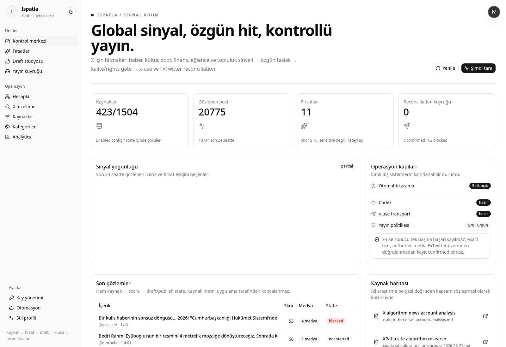
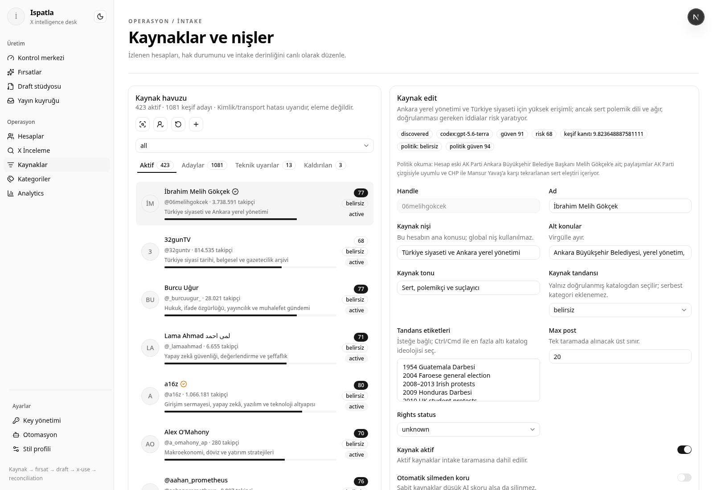

# Ispatla

Ispatla, XPatla araştırmalarındaki `style context → Market → üretim → kalite →
otomasyon → feedback` mantığını bağımsız bir Next.js ürün paneline çevirir.
Vesper veya Hermes runtime’ına bağlı değildir. Uygulama Next.js, TypeScript,
Tailwind v4, shadcn/ui ve SQLite kullanır.



> Görsel, lokal uygulamadan alınmış kontrol paneli ekranıdır. Canlı X hesabı,
> cookie veya production secret içermez.

## Ürün döngüsü

```text
FxTwitter kaynakları
  -> provenance + SQLite intake
  -> quote / reply / mention kaynak keşfi
  -> Luna medium + Terra review kaynak ve Market skoru
  -> hesap style profile ile draft varyantları
  -> quality / uncertainty / rights gate
  -> x-use automation queue
  -> action receipt
  -> FxTwitter exact text + author reconciliation
  -> feedback snapshot + analytics
```

## Neler var?

- Dashboard: scan, operasyon kapıları, sinyal grafiği ve son gözlemler
- Fırsatlar (`/opportunities`, eski `/market` URL’si de çalışır): fırsat skoru,
  freshness, velocity, relevance, risk; AI doğrulanmış ve AI bekleyen kayıtlar
  ayrı görünür
- Draft stüdyosu: original post, quote, reply, thread ve DM formatları; varyant,
  stil bağlamı, gate sonucu, manuel edit, çoklu hesap batch’i ve kuyruğa alma
- Sohbet (`/chat`): Üretim grubunun ana çalışma alanı; `/generate`, `/post`,
  `/queue`, `/send`, `/cancel` komutları, kalıcı SQLite geçmişi ve gerçek
  queue/send/cancel işlemlerinde insan onayı
- Yerel usage ledger: XPatla dokümanındaki format kredileri (post 15, quote/reply/DM
  25, thread 100); Stripe veya dış faturalama yok
- Hesap listesi/edit: handle, x-use account id, default hesap, günlük limit,
  otomasyon modu ve stil profili (günlük limit alanı kaydedilir; otomatik yayında
  şu an hesap bazında değil, global 6 yayın/24 saat limiti uygulanır)
- Kaynak yönetimi: takip edilen hesap, max post, enabled/disabled ve rights status
- Otomatik kaynak keşfi: 10 doğrulanmış başlangıç hesabı, hesap avatarı, AI kaynak
  skoru, confidence, pin koruması, aday terfisi ve düşük kaynak yaşam döngüsü


- Yayın kuyruğu: queued, running, pending_reconciliation, confirmed, blocked,
  failed, cancelled; retry bir durum değil tekrar kuyruğa alma aksiyonudur
- Reconciliation: x-use receipt’i tek başına başarı sayılmaz; uzak sonuç
  doğrulanmadan `confirmed` oluşmaz. Uzak doğrulama kanıtı aynı metin ve yazar
  eşleşmesidir; medya eşleşmesi bu kanıtın parçası değildir.
- Key edit: OpenAI, OpenAI-uyumlu AI ve x-use integration secret’ları
  server-side AES-256-GCM kasada maskeli yönetilir; AI çalıştırıcısı olarak
  OpenAI Responses API, kullanıcı tanımlı OpenAI-uyumlu endpoint veya yerel
  Codex CLI seçilebilir ve tüm yeni AI çağrıları tek anahtarla kapatılabilir
- Analytics: draft, queue, confirmed, blocked, failed, feedback snapshot ve aylık
  yerel AI kullanım/bütçe özeti
- Global automation kill switch ve x-use capability ekranı
- Tema sistemi: sistem varsayılanı, açık/koyu geçişi ve shadcn semantic token’ları

## Çalıştırma

```sh
cp config/sources.example.json config/sources.json
bun install --frozen-lockfile
bun dev
```

Arayüz: `http://localhost:3000`

Kontrol komutları:

```sh
bun test
bun run lint
bun run typecheck
bun run build
bun audit
bun start
```

SQLite state varsayılan olarak `state/ispatla.sqlite3` altında tutulur.
`ISPATLA_SOURCES` ile source JSON, `ISPATLA_DB` ile SQLite dosyası değiştirilebilir.

## x-use kurulumu

x-use Ispatla’ya vendored dependency olarak kopyalanmaz; ayrı bir Python +
Chromium runtime’ı olarak çalışır:

```sh
pipx install x-use-mcp
x-use doctor
x-use --help
```

Alternatif:

```sh
uv tool install x-use-mcp
```

Ispatla `XUSE_BIN` ile binary seçebilir. Varsayılan `x-use` komutudur.
Mevcut doğrulanmış yayın kontratı:

```text
x-use mcp
  initialize
  tools/call queue_post(account, text, media)
  tools/call process_queue(account, max_actions=1)
```

Panel x-use’ın gerçek runtime yardım/doctor çıktısından capability keşfeder ve
stdio MCP JSON-RPC üzerinden yalnız `queue_post` + açık `process_queue` kapısını
çağırır. Receipt yayın kanıtı değildir; text/author/media reconciliation olmadan
`confirmed` oluşmaz. CLI kontratı doğrulanmamış quote/reply/thread/DM aksiyonları
draft olarak kalır.

## Secret ve otomasyon ayarları

Production’da key edit kullanmak için encryption master secret zorunludur:

```sh
export ISPATLA_SECRET_KEY="uzun-rastgele-production-secret"
```

Environment fallback ile OpenAI kullanmak istersen:

```sh
export OPENAI_API_KEY="..."
```

Codex kullanmak için Codex CLI’nin ayrı oturumunu aç:

```sh
codex login
codex login status
```

Ardından `/settings/keys` içindeki AI çalıştırıcısı alanından `OpenAI API`,
`OpenAI-uyumlu API` veya `Codex` ve istediğin modeli seç. OpenAI-uyumlu seçenek
HTTPS bir temel URL, sağlayıcının model kimliği ve ayrı kasada saklanan API
anahtarı alır; uygulama `/chat/completions` çağrısına JSON Schema sözleşmesi
gönderir. Bu yol OpenRouter/Groq/yerel gateway gibi bu sözleşmeyi destekleyen
servisler içindir; tamamen farklı özel API’ler uyumlu bir proxy gerektirir.
Kaynak, Market, draft ve sohbet intent çağrıları aynı seçime uymaya devam eder.
Codex yolu `codex exec --ephemeral --sandbox read-only`
ile çalışır; subprocess yalnız Codex auth/config, executable path, locale, TLS ve
proxy için gereken environment alanlarını alır. Uygulamanın OpenAI key’i, kasa
anahtarı ve admin token’ı Codex subprocess’ine geçirilmez.
`CODEX_BIN` ile farklı bir Codex binary’si seçilebilir.

Kaynak ve Market skoru varsayılan olarak seçili provider üzerindeki
`gpt-5.6-luna` medium reasoning ile çalışır.
Confidence düşükse, skor 65–75 eşik aralığındaysa veya kaynak silinmek üzereyse
`gpt-5.6-terra` ikinci görüş verir. Model erişimi yoksa terfi, otomatik silme ve
otomatik yayın fail-closed durur; mevcut intake verisi kaybolmaz.

## Kaynak keşfi

İlk çalıştırmada eksik olan şu 10 kaynak bir kez eklenir:

`bpthaber`, `anadoluajansi`, `trthaber`, `ntv`, `bbcturkce`, `dw_turkce`,
`euronews_tr`, `teyitorg`, `t24comtr`, `pusholder`.

Yeni kaynaklar izlenen postların quote yazarı, reply hedefi ve mention
hesaplarından bulunur. Quote 3, reply 2, mention 1 kanıt puanı taşır. Üç kanıt
puanına ulaşan aday AI değerlendirmesine girer; skor ve confidence en az 70 ise
aktifleşir. Sabitlenmemiş bir kaynak üç günlük değerlendirmede 40 altında kalır
ve Terra sonucu doğrularsa kaynak kaydı silinir. Geçmiş post provenance’ı
korunur ve hesap yedi gün yeniden keşfedilmez.

Gösterilen değer Ispatla tahminidir; X'in iç sıralama skoru veya erişim
garantisi değildir.

Otomasyon scheduler’ı kapatmak için:

```sh
export ISPATLA_AUTOMATION=0
```

### Kesintiye dayanıklı kaynak worker’ı

Next uygulaması çalışırken kendi içindeki beş dakikalık scheduler taramayı
başlatır. Aylarca gözetimsiz kullanım için bu tek başına yeterli değildir:
process yeniden başlatılırsa veya host uyursa timer da durur. Repo, aynı
idempotent scan akışını ayrı process olarak çalıştıran `automation:scan`
komutunu ve örnek bir kullanıcı-level systemd timer’ını içerir. Worker sonuç
kaydı SQLite’a yazılır; `partial` ya da `skipped` çıkış kodu sıfır olmayan bir
sonuç üretir, böylece timer başarısızlığı dışarıdan izlenebilir.
Unit, kullanıcı systemd PATH’inin shell PATH’inden farklı olabilmesi nedeniyle
doğrulanmış Bun konumunu (`~/.bun/bin`) service PATH’ine ekler.

```sh
mkdir -p ~/.config/systemd/user ~/.config/ispatla
cp systemd/ispatla-scan.service ~/.config/systemd/user/
cp systemd/ispatla-scan.timer ~/.config/systemd/user/
# ~/.config/ispatla/worker.env içine yalnız gerekli environment değerlerini yaz:
# ISPATLA_SECRET_KEY=...
# ISPATLA_DB=/mutlak/yol/ispatla.sqlite3
# AI_COMPATIBLE_API_KEY=...   # seçili özel provider bunu kullanıyorsa
# Web uygulamasının service environment’ına ISPATLA_AUTOMATION=0 ekle.
# Böylece Next içi timer yerine yalnız bu systemd timer scan yapar.
systemctl --user daemon-reload
systemctl --user enable --now ispatla-scan.timer
systemctl --user list-timers ispatla-scan.timer
journalctl --user -u ispatla-scan.service -n 30
```

Timer sonraki worker run’ını öncekinin bitiminden beş dakika sonra planlar; `flock`
aynı anda iki run başlatılmasına karşı ikinci korumadır. Web uygulamasında
`ISPATLA_AUTOMATION=0` olmadan Next içi timer da çalışacağı için bu iki
scheduler’ı aynı anda etkinleştirme. Ayrı worker ve Next uygulamasını aynı
SQLite dosyasına bağlamadan önce gerçek deployment ortamında SQLite locking
davranışını doğrula. Uzak X yayınları, mevcut quality, rights, x-use ve
reconciliation kapılarından geçmeden başarılı sayılmaz.

Production mutation endpoint’lerinde defense-in-depth Bearer kontrolü için:

```sh
export ISPATLA_ADMIN_TOKEN="..."
```

İsteklerde `Authorization: Bearer <token>` gerekir. Token yoksa mutation
endpoint’leri fail-closed `503`, yanlış token `401` döndürür. Production’da
yalnız dashboard değil bütün sayfa ve API yüzeyi hassastır: hesaplar, draftlar,
chat, kuyruk, key metadata’sı ve usage bilgisi dahil tüm uygulama VPN veya kimlik
doğrulayan reverse proxy arkasında olmalıdır. Panel mutasyonlarının çalışması
için proxy doğrulanmış isteğe server tarafında bu Bearer header’ını eklemelidir;
token browser bundle’ına veya local storage’a konmamalıdır.

Otomatik yayınların FxTwitter üzerinden doğrulanıp `confirmed`’a geçebilmesi
için yayın yapan hesabın handle’ı verilir; bu tanımsızsa denemeler
`pending_reconciliation` durumunda kalır:

```sh
export ISPUBLISHER_HANDLE="yayin-hesabi-handle"
```

Secret değerleri repo, SQLite plaintext alanı, HTML, API response, x-use receipt
ve log içine yazılmaz. x-use cookie/session yönetimi x-use tarafında kalır.

## Yayın güvenliği

- Sensitive kaynaklar otomatik yayın kapısından geçemez.
- Skor, cluster duplicate, global yayın limiti (6/24 saat) ve quality gate
  uygulanır.
- 15 saniyelik process-local throttle yalnız pahalı scan ve reconciliation
  tetikleyicilerine uygulanır; normal authenticated CRUD işlemlerini kilitlemez.
- Fotoğraf/video yalnızca `rightsStatus: "cleared"` kaynaklarda allowlist, MIME,
  magic byte, boyut ve SHA-256 kontrollerinden sonra x-use’a verilir.
- Belirsiz write tekrar edilmez; pending reconciliation state korunur.
- x-use yoksa veya doctor/capability başarısızsa panel bunu açıkça gösterir.
- `X-Content-Type-Options`, `X-Frame-Options`, `Referrer-Policy` ve
  `Permissions-Policy` güvenlik header’ları aktiftir.

## Araştırma kaynakları

- [X algorithm news account analysis](x-algorithm-news-account-analysis.md)
- [XPatla site algoritma araştırması — 2026-08-21](xpatla-site-algoritma-arastirmasi-2026-08-21.md)
- [Araştırma → uygulama eşlemesi](docs/RESEARCH-MAP.md)
- [Pentest raporu](docs/PENTEST-REPORT.md)

İki Markdown dosyası kaynak metin olarak korunur. Kapalı X ağırlıkları,
XPatla’nın özel skorları veya özel prompt’ları gerçekmiş gibi uydurulmaz.
