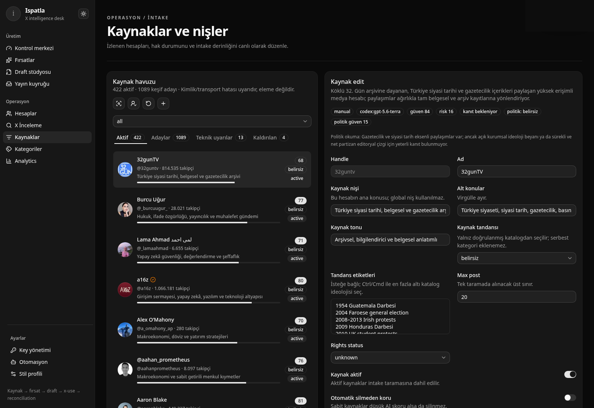

# MAKE XPATLA GREAT AGAIN

## Ispatla — global X auto-hitmaker

İlk sinyali yakala. Kanıtı koru. Hesabın dilinde üret. İnsan onayı olmadan
yayınlama.

Ispatla, X üzerindeki küresel sinyali hesap kimliğine uygun özgün hit'lere
dönüştüren bir **auto-hitmaker**'dır. Bu yalnızca haber için bir newsroom
değildir: kültür, spor, finans, eğlence, teknoloji, topluluk ve marka hesapları
aynı fırsat motorunu kullanabilir.

Auto-hitmaker her şeyi körlemesine yayınlayan bir bot değildir. Ispatla fırsatı
ve doğru formatı otomatik bulur, hesabın stiline göre özgün varyantlar üretir;
operatör ise yayın niyetini açıkça onaylar. Böylece hız otomatikleşir, ses ve
sorumluluk hesap sahibinde kalır.

> X'in gizli sıralama skorunu, erişimini veya gelirini vaat etmiyoruz. Ispatla;
> gözlenen açık veriden çalışan, kararları ve kanıt sınırını görünür tutan bir
> hit operasyon aracıdır.


## Tek döngü, bütün operasyon

```text
Global source graph + discovery queries
  -> XReader normalization + provenance
  -> monitoring budget + adaptive cadence
  -> opportunity and account decision
  -> style-aware draft + safety gates
  -> PublicationIntent + explicit approval
  -> XPublisher / x-use receipt
  -> reconciliation + feedback
  -> stronger monitoring and query choices
```

### Radar

- Account, keyword, search-query ve conversation monitor'ları tek scheduler
  içinde çalışır.
- Hot/warm/normal/cold cadence, breakout sonrası burst mode ve günlük request
  bütçesi, taramayı her kaynağa eşit kör polling yapmaktan çıkarır.
- Discovery Query Engine, kategori tanımından sorgu adayları üretir; hit yield,
  duplicate rate, false-positive rate ve lead time ile iyi sorguları güçlendirir.

### Hit karar masası

- Fırsatlar yalnız taze, sensitive olmayan ve deterministik eşiklerini geçen
  gözlenen postlardan oluşur; haber, trend, fandom, piyasa, spor veya internet
  kültürü için `Gözlenen 24s`, `Fırsatlar` ve `Elenen` akışları birbirinden
  ayrıdır.
- Hesap başına stil, kategori ve örnek post bağlamı korunur. Aynı olay farklı
  hesaplarda aynı metne dönüşmek zorunda değildir.
- Kaynak kimliği ya da transport uyuşmazlığı **teknik uyarıdır**, eleme değildir.
  Kaynaklar ancak açık bir işlemle kaldırılır; AI'nın öznel düşük puanı kayıt
  silmez.



### Güvenli yayın hattı

- Draft doğrudan yayın kuyruğu değildir. `PublicationIntent`, idempotency key,
  açık insan onayı, x-use receipt'i ve reconciliation ayrı durumlarda tutulur.
- Receipt başarı kanıtı değildir: exact text ve author FxTwitter üzerinden
  doğrulanmadan yayın `confirmed` sayılmaz.
- Sensitive içerik, telif/rights, kopyalama, duplicate cluster ve yayın limiti
  kapıları yayın denemesinden önce çalışır. Belirsiz write tekrar edilmez.

### Agent-first, provider-independent

- `FxTwitterReader` bugünün transport'udur; canonical `XPost`, `XProfile`,
  `XMetricSnapshot`, `XTimelineBatch` ve `XSearchResult` modeli yarının
  sağlayıcısına kilitlenmez.
- `XUsePublisher` bugünün yayın adaptörüdür; publication sözleşmesi transport
  ayrıntısından bağımsızdır.
- Sohbet yüzeyi yerine Ispatla kendi stdio MCP server'ını sunar:
  `ispatla.opportunities.list`, `ispatla.sources.health`,
  `ispatla.drafts.generate`, `ispatla.publications.queue` ve
  `ispatla.analytics.performance` gibi araçlar Codex, Claude veya başka bir
  MCP istemcisine doğrudan bağlanır. Mutasyon araçları ikinci bir `confirm=true`
  çağrısı ister.

## Hızlı başlangıç

```sh
cp config/sources.example.json config/sources.json
bun install --frozen-lockfile
bun dev
```

Arayüz: `http://localhost:3000`

```sh
bun test
bun run lint
bun run typecheck
bun run build
bun run mcp
```

SQLite state varsayılan olarak `state/ispatla.sqlite3` altındadır.
`ISPATLA_SOURCES` kaynak JSON'unu, `ISPATLA_DB` SQLite dosyasını değiştirir.

## X transport ve yayın kurulumu

Ispatla x-use'ı dependency veya vendored kod olarak taşımaz. x-use ayrı bir
Python + Chromium runtime'ıdır; Ispatla stdio MCP JSON-RPC üzerinden yalnız
kanıtlanmış `queue_post` ve açık `process_queue` kapılarını kullanır.

```sh
pipx install x-use-mcp
x-use doctor
```

Alternatif olarak `uv tool install x-use-mcp` kullanılabilir. `XUSE_BIN` ile
binary seçilir. x-use cookie/session yönetimi x-use tarafında kalır; session
dosyaları repo içine yazılmaz.

OpenAI API, OpenAI-uyumlu endpoint veya yerel Codex CLI `/settings/keys`
üzerinden seçilebilir. AI tamamen kapalıyken mevcut hazır metinler korunur;
yalnız yeni model çağrıları fail-closed durur. Provider anahtarları server-side
AES-256-GCM kasada tutulur.

Production'da:

```sh
export ISPATLA_SECRET_KEY="uzun-rastgele-production-secret"
export ISPATLA_ADMIN_TOKEN="..."
export ISPUBLISHER_HANDLE="yayin-hesabi-handle"
```

`ISPATLA_ADMIN_TOKEN` mutation endpoint'lerinde defense-in-depth Bearer
kontrolüdür. Tüm panel; hesap, draft, yayın ve usage verisi içerdiği için VPN,
kimlik doğrulayan reverse proxy veya uygulama oturumu arkasında çalışmalıdır.
Token browser bundle'ına, local storage'a veya loglara konmaz.

## Sürekli operasyon

Web uygulaması kendi scheduler'ını çalıştırabilir. Uzun ömürlü operasyon için
repo, 15 saniyelik tick ile zamanı gelen monitor, scan, liveness, kuyruk ve
reconciliation işlerini SQLite üzerinden atomik yürüten ayrı worker sağlar:

```sh
bash scripts/install-systemd-user.sh
systemctl --user status ispatla-worker.service
journalctl --user -u ispatla-worker.service -n 50 --no-pager
```

Worker ve Next içi scheduler aynı SQLite dosyasında aynı anda açılmamalıdır.
Worker için gerekli secret'lar yalnız `~/.config/ispatla/worker.env` içinde
tutulur; servis gerektiğinde bu dosyayı oluşturur, var olanını ezmez.

## Kaynaklar

- [XPatla](https://xpatla.com)
- [X algorithm — xai-org/x-algorithm](https://github.com/xai-org/x-algorithm)
